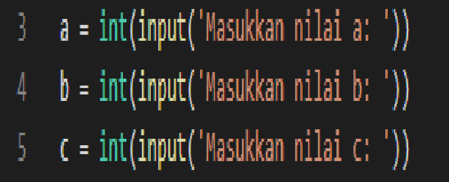
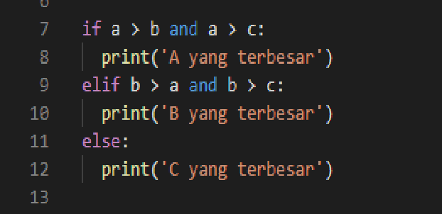
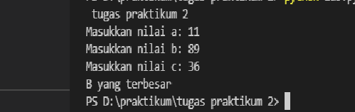

# tugas praktikum 3

## persiapan variabel 

kita mulai langsung dengan menyiapkan 3 buah variabel, yaitu a, b, dan c.
Ketiga variabel ini kita isi dari inputan user seperti berikut:

## Mencari Angka Terbesar Antara a, b, dan c

Langkah selanjutnya adalah menulis logika untuk mencari angka terbesar, apakah itu a? b? atau c?
Berikut ini kira-kira implementasi logikanya:

### output

Kelemahan dari kode di atas adalah, jika kita masukkan 3 angka yang sama, maka nilai C lah yang dianggap terbesar. Kalian bisa memodifikasi sendiri agar kalau angkanya sama, output yang ditampilkan adalah “Ketiga angka sama”